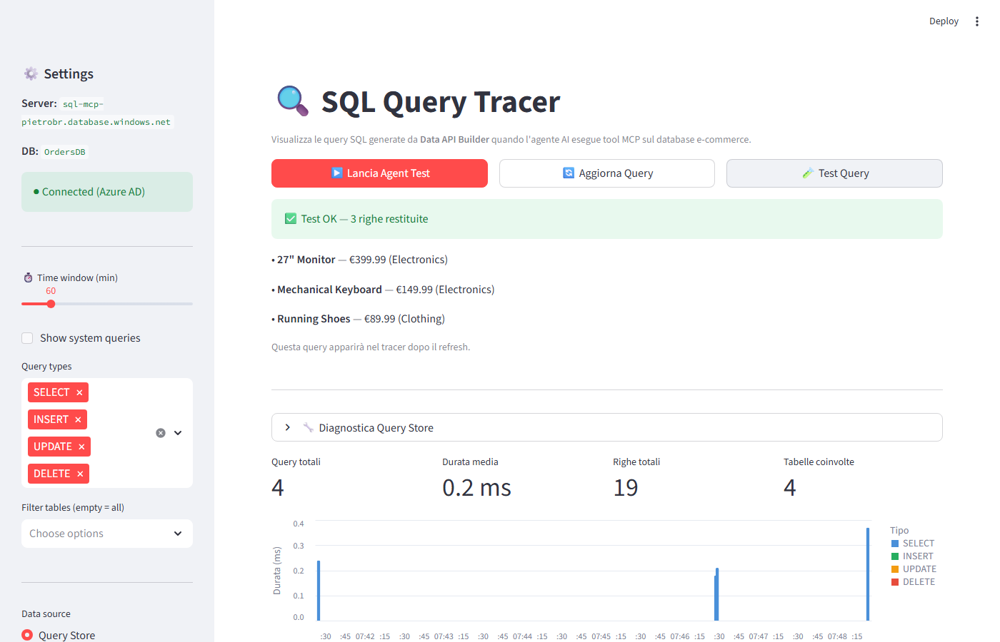

# SQL MCP Server — Test Project

Test project for **Data API Builder (DAB) SQL MCP Server** with an **Azure AI Foundry** agent.

## Architecture

```
Azure AI Foundry Agent (GPT-4o)
        ↓ MCP protocol
SQL MCP Server (DAB v1.7)
        ↓ T-SQL (deterministic)
Azure SQL Database (OrdersDB)
```

## Database Schema

| Table | Description | Rows |
|---|---|---|
| `dbo.Categories` | Product categories (Electronics, Books, Clothing) | 3 |
| `dbo.Products` | Products with prices, linked to categories | 10 |
| `dbo.Customers` | Registered customers | 5 |
| `dbo.Orders` | Orders with status and totals | 8 |
| `dbo.OrderItems` | Line items linking orders to products | 20 |

### Relationships
- Category 1:M Products
- Customer 1:M Orders
- Order 1:M OrderItems
- Product 1:M OrderItems

## Prerequisites

- [.NET 8 SDK](https://dotnet.microsoft.com/download/dotnet/8.0)
- [Azure CLI](https://learn.microsoft.com/cli/azure/install-azure-cli) (`az login` completed)
- Python 3.10+
- Azure AI Foundry project with GPT-4o deployed

## Quick Start

### 1. Install DAB CLI

```bash
dotnet tool install --global Microsoft.DataApiBuilder --prerelease
dab --version  # should be >= 1.7.x-rc
```

### 2. Run DAB locally

```bash
dab start --verbose
```

This starts:
- **REST**: `http://localhost:5000/api/{entity}`
- **GraphQL**: `http://localhost:5000/graphql`
- **MCP**: `http://localhost:5000/mcp`

### 3. Test REST endpoint

```bash
curl http://localhost:5000/api/Product
```

### 4. Configure the Python agent

```bash
cp .env.template .env
# Edit .env with your Azure AI Foundry project details
```

### 5. Run the test agent

```bash
pip install -r requirements.txt
python test_agent.py
```

## Deploy to Azure Container Apps

Automated scripts are provided in `scripts/` to create the full Azure environment.

### Prerequisites

- [Azure CLI](https://learn.microsoft.com/cli/azure/install-azure-cli) logged in (`az login`)
- Python 3.10+ with `pyodbc` installed (for database seeding)
- ODBC Driver 17 for SQL Server

### Step 1 — Create Azure resources

Creates resource group, Azure SQL Server (Azure AD-only auth), database, and firewall rules.

```bash
scripts/01-create-azure-resources.sh
```

### Step 2 — Seed the database

Runs `sql/setup.sql` to create tables and insert sample data. Enables Query Store.

```bash
scripts/02-seed-database.sh
```

### Step 3 — Deploy DAB to Container Apps

Builds the Docker image in ACR and deploys to Azure Container Apps.

```bash
scripts/03-deploy-container-app.sh
```

After deployment, update `.env` with the MCP URL printed by the script.

### Step 4 — Create AI Foundry project & deploy model

Creates an Azure AI Foundry hub, project, and deploys GPT-4o.

```bash
scripts/04-create-foundry-project.sh
```

After creation, update `.env` with the `PROJECT_ENDPOINT` and `MODEL_DEPLOYMENT_NAME` printed by the script.

### Step 5 — Deploy Streamlit Query Tracer

Builds and deploys the Query Tracer UI to Azure Container Apps.

```bash
scripts/05-deploy-streamlit.sh
```

After deployment, grant SQL read access to the container's managed identity (T-SQL printed by the script).

### Customization

Override defaults with environment variables:

```bash
RESOURCE_GROUP=my-rg \
LOCATION=westeurope \
SQL_SERVER_NAME=my-sql-server \
  scripts/01-create-azure-resources.sh
```

### Teardown

Delete all Azure resources:

```bash
scripts/99-teardown.sh
```

## DAB Configuration

The `dab-config.json` file controls everything:
- **Database connection**: Azure SQL with Azure AD authentication
- **Entities**: 5 entities with semantic descriptions for AI agent understanding
- **Relationships**: Cross-entity navigation (e.g., Order → Customer)
- **MCP**: Enabled at `/mcp` with all DML tools active
- **Permissions**: `anonymous:*` for testing (restrict in production)

## MCP Tools Available

The SQL MCP Server exposes 6 DML tools:

| Tool | Description |
|---|---|
| `describe_entities` | List available entities and their fields |
| `create_record` | Insert a new record |
| `read_records` | Read records with filters, pagination, sorting |
| `update_record` | Update an existing record |
| `delete_record` | Delete a record |
| `execute_entity` | Execute stored procedures |

## Key Design: NL2DAB (not NL2SQL)

The agent **never generates raw SQL**. Instead, it calls structured MCP tools → DAB's Query Builder generates deterministic T-SQL internally. This eliminates the risks of AI-generated SQL.

## Query Tracer UI

A Streamlit-based UI to visualize the SQL queries that DAB generates when the AI agent calls MCP tools.



### Features
- **Real-time SQL tracing** via Azure SQL Query Store
- **Query classification** — maps each SQL statement back to the probable MCP tool (`read_records`, `create_record`, etc.)
- **Performance metrics** — duration, CPU, IO reads, row count per query
- **Timeline chart** — visual bar chart of query durations over time
- **Built-in agent launcher** — run `test_agent.py` directly from the UI
- **Filters** — by query type (SELECT/INSERT/UPDATE/DELETE), table, time window

### Run the tracer

```bash
streamlit run query_tracer.py
```

## Azure Resources Created

| Resource | Name |
|---|---|
| Resource Group | `rg-sql-mcp` |
| Azure SQL Server | `sql-mcp-pietrobr.database.windows.net` |
| Database | `OrdersDB` |
| Auth | Azure AD-only (no SQL auth) |

## Cleanup

```bash
scripts/99-teardown.sh
# or manually:
az group delete --name rg-sql-mcp --yes --no-wait
```
